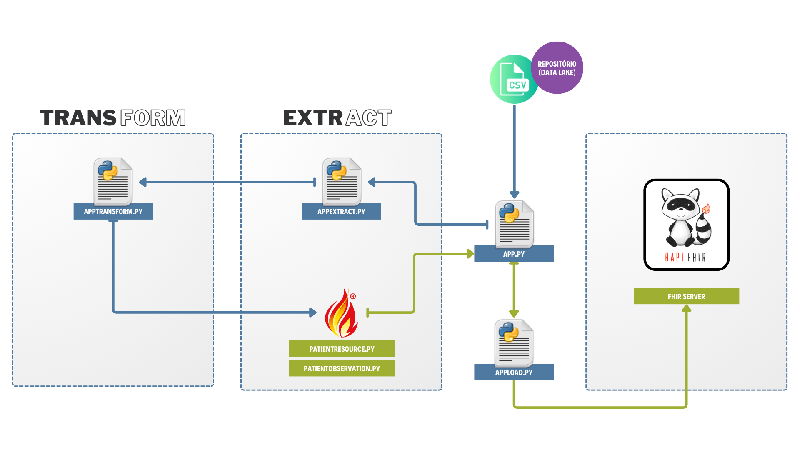

Aqui está o conteúdo formatado em Markdown:

# fhirserver
POC para criação de Servidor baseado em FHIR

## Configuração de Servidor FHIR (Arquitetura)

1. **Arquitetura construída sobre um servidor Linux em ambiente Windows utilizando Oracle VirtualBox**:
   - 8Gb de RAM, 50Gb de armazenamento e 2 CPU's, pela praticidade de ter um servidor Linux com distribuição Ubuntu LTS on-premises.
   - Faça o download do VirtualBox no link [VirtualBox Downloads](https://www.virtualbox.org/wiki/Downloads) e instale.

2. **Distribuição Linux Ubuntu 20.04.3 LTS**:
   - Por ser a distribuição mais difundida e ter uma comunidade ativa.
   - Também por se demonstrar uma versão estável para o projeto.
   - Optei por versão LTS (Long Term Support).
   - Efetuar download do ISO e disponibilizar em diretório para instalação na VM (Workspace/iso).

3. **Para criação de VM no Virtual Box com a imagem Linux**:
   - Siga o passo a passo para criação de VM no VirtualBox, configurando o diretório para instalação do SO para o diretório Workspace/iso_linux, além de configurar a VM no diretório Workspace/vm.

4. **Instalação do Docker no Ubuntu**:
   - Utilizando APT do Linux Ubuntu e o PIP Install do Python, incluindo docker-compose para salvar configurações do servidor.
   - Códigos utilizados:
     ```bash
     # Docker:
     sudo apt update
     sudo apt install -y apt-transport-https ca-certificates curl software-properties-common
     curl -fsSL https://download.docker.com/linux/ubuntu/gpg | sudo gpg --dearmor -o /usr/share/keyrings/docker-archive-keyring.gpg
     echo "deb [arch=amd64 signed-by=/usr/share/keyrings/docker-archive-keyring.gpg] https://download.docker.com/linux/ubuntu $(lsb_release -cs) stable" | sudo tee /etc/apt/sources.list.d/docker.list > /dev/null
     sudo apt update
     sudo apt install -y docker-ce docker-ce-cli containerd.io
     sudo systemctl enable --now docker

     # Docker Compose:
     pip install docker-compose
     docker-compose --version
     ```

5. **Gerado Docker Compose baseado em imagens disponíveis no Docker Hub**:
   - Utilizando HAPI FHIR para criação de servidor FHIR baseado nas seguintes Tecnologias:
     - Java, Spring Boot (RestFull), Hibernate, PostgreSQL, Tomcat (Server), JSON / XML, Swagger (Documentação).
   - Podemos destacar que a HAPI FHIR implementa em 100% o padrão FHIR.
   - Para mais informações da implementação, acesse: [Link da Imagem e documentação HAPI FHIR implementado com PostgreSQL](https://hub.docker.com/r/hapiproject/hapi)

6. **Sobre o Docker Compose gerado**:
   - O arquivo foi criado baseado nas especificações do Docker Compose .yaml 3.8, executado sobre engine docker compose 1.29 com implementação extra de segurança para não expor dados sensíveis de acesso ao banco de dados, adotando outra abordagem, que seria configuração dessas informações diretamente no ambiente de variáveis do sistema operacional.
   - Para isso, foi criado o arquivo .env que armazena essas informações.

7. **Docker Compose do FHIRServer possui volumes para armazenamento das persistências PostgreSQL on-premises**:
   - Necessário executar o arquivo "volumes" se for manter os dados do contêiner localmente.
  
8. **O ETL foi construído em estrutura Python, com camada Extract, Transform e Load separadas e modularizadas:**
   - Criadas classes que implementam os dois objetos enviados para o servidor FHIR: PatientResource e PatientObservation;
   - Criado arquivo orquestrador do Pipeline de carga, chamado app.py, que efetua a carga nos Endpoints do Servidor FHIR.
   
   
   
9. **A Classe PatientResource.py implementa as especificações do profile Resource Patient para as necessidades nacionais:**
   - A fonte de dados não possui todos os campos que estão propostos no Profile, sendo assim, a classe PatientResource foi adaptada para conter os campos da fonte de dados, em seus respectivos mapeamentos do profile;
   - Para fins de teste, foram mantidos alguns campos nulos do profile proposto, apenas para averiguar como a API se comportaria ao inserir um paciente incompleto.
   
   
   
10. **Considerações sobre a implementação do Profile Resource Patient nacional:**
   - A fonte de dados não possui todos os campos que estão propostos no Profile, sendo assim, a classe PatientResource foi adaptada para conter os campos da fonte de dados, em seus respectivos mapeamentos do profile;
   - Para fins de teste, foram mantidos alguns campos nulos do profile proposto, apenas para averiguar como a API se comportaria ao inserir um paciente incompleto.
   
 
 
## Agradecimento

Gostaria de expressar meus sinceros agradecimentos aos organizadores do teste por esta valiosa oportunidade de desenvolver e demonstrar meu trabalho Este projeto representa um esforço individual e um marco importante em minha jornada profissional.

**Resumo de desenvolvimento**

O desenvolvimento deste Projeto FHIR envolveu várias etapas cruciais, desde a configuração da arquitetura até a implementação de funcionalidades específicas. Cada fase deste projeto representou um desafio empolgante:

- **Configuração de Servidor FHIR (Arquitetura)**: A primeira etapa envolveu a criação de uma arquitetura robusta com base em um servidor Linux Ubuntu. Isso proporcionou um ambiente sólido para a construção do servidor FHIR.

- **Instalação do Docker e Docker Compose**: A instalação do Docker no Ubuntu foi fundamental para o contêiner do servidor FHIR. A configuração cuidadosa das variáveis do sistema operacional e a criação do Docker Compose permitiram que o servidor fosse executado com eficiência.

- **Gerenciamento de Dados com PostgreSQL**: O servidor FHIR dependia de um sistema de gerenciamento de banco de dados PostgreSQL, e a criação de volumes para armazenar dados persistentes foi um passo essencial. Além disso, estudar e pesquisar a documentação da HAPI FHIR permitiu manipular os dados do banco pela interface do servidor.

- **Implementação do ETL (Extract, Transform, Load)**: A estrutura Python do ETL permitiu a extração, transformação e carregamento de dados com eficácia. As classes PatientResource e PatientObservation foram desenvolvidas para atender às especificações do servidor FHIR e garantir a interoperabilidade de dados.

**Implementação do Perfil Resource Patient**

A adaptação do perfil Resource Patient para atender às necessidades nacionais foi um desafio significativo (Além de fazer parte do Bônus). A classe PatientResource foi cuidadosamente projetada para refletir os dados da fonte de forma precisa e compatível com as especificações FHIR.

**Agradecimento Especial**

Por fim, gostaria de estender um agradecimento especial a todos os envolvidos, ao Rhawan Brenner pela indicação e à Kristiane por me selecionar e me permitir demonstrar meus talentos por esta oportunidade única. Este projeto representou um esforço individual dedicado a contribuir para a interoperabilidade de dados de saúde nacional.

Obrigado por acreditar em meu trabalho e fornecer um cenário para aplicar meus conhecimentos e habilidades. Esta experiência foi inestimável para o meu crescimento profissional, e estou grato pela oportunidade.


Adriano Freitas / Engenheiro de Dados.

   
